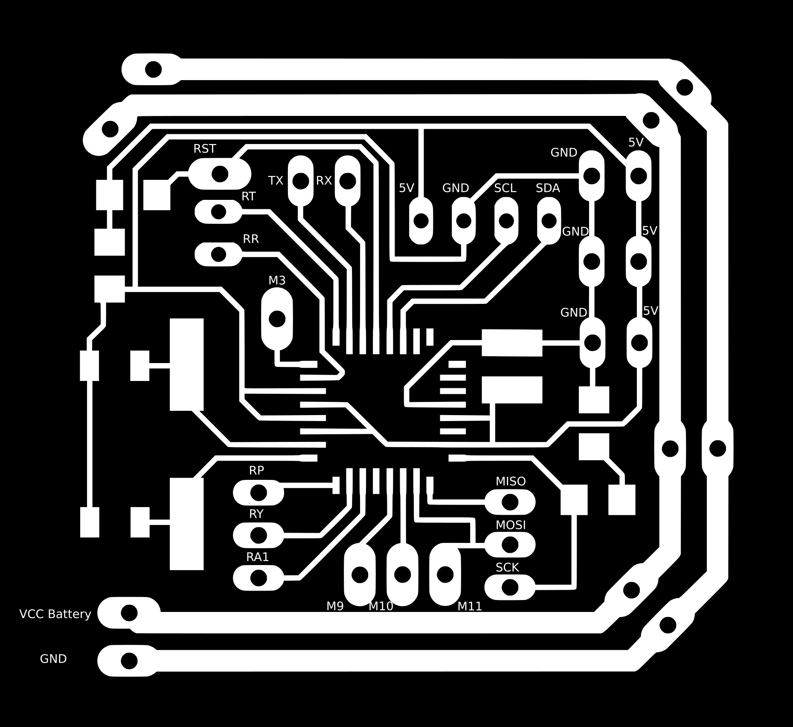

<h1 style="font-family: courier;" align="center">satshacopter 150X</h1>

<i>An open source,small, low cost and fabbable quad X drone.</i>

  

satshacopter 150X
--

satshacopter 150X is a quadcopter built around the **[satshakit mini flight controller](https://github.com/satshakit/satshakit-mini-flight-controller)** and derived from its big brother [satshacopter 250X](https://github.com/satshacopter/satshacopter-250X). It is designed to be **simple and cheap as much as possible**, and to be easily made inside any **Fab Lab**.

150X specifications:

- **150mm mdf frame** and supports
- **open source flight controller**
- **MPU6050 IMU** located exactly at the center
- 4 x 3100kv **brushless motors**
- 4 x 6A **ESCs**
- **MultiWii** compatible
- Hobby King 4 channel **remote and receiver**
- 1000mah 2S 65C **LiPo battery** 
- costs around **100€**

Here you can look about the **MultiWii pin mapping** of the satshakit mini flight controller board:

And here you can che the required components in the **Bill of Material** table:

|name|description|vendor|link|price|notes|
|:---:| :---:|:---:|:---:|:---:|:---:|
|2.4Ghz4Ch TxRx V2|4ch mode 2 remote control and receiver|Hobby King|[link](http://www.hobbyking.com/hobbyking/store/__66499__Hobby_King_2_4Ghz_4Ch_Tx_Rx_V2_Mode_2_EU_Warehouse_.html)|23.14€|-|
|Turnigy Graphene|battery 1000mah 2s 65C|Hobby King|[link](https://hobbyking.com/en_us/graphene-1000mah-2s-65c-w-xt60.html)|8.42€|-|
|LDPOWER D150 Multicopter Power System|4 x MT1306-3100KV motors and 4 x 6A esc|Hobby King EU|[link](https://hobbyking.com/en_us/ldpower-d150-multicopter-power-system-mt1306-3100kv-4-x-4-5-4-pack.html)|59.26€|propellers Included|
|IMU 6DOF|MPU6050 Gyro + Acc IMU|Ebay|[link](http://www.ebay.de/itm/MPU-6050-GY-521-3-Achsen-Gyroskop-Accelerometer-Kreisel-Board-Sensor-Arduino-21-/121887579651)|5.39€|-|
|LiPo Charger and Balancer|800mah 3s LiPo charger|Hobby King|[link](http://www.hobbyking.com/hobbyking/store/uh_viewitem.asp?idproduct=77525)|6.99€|-|
|Fligh Controller|satshakit mini flight controller|various|[link](https://github.com/satshakit/satshakit-flight-controller)|4.00-8.00€|depending on the quantity|
||||**Total price**|103.2€+4/8€|-|

NOTE: prices may change over time on the respective vendors, and also it is highly dependand on the quantity of drones you want to make.

Downloads
--

If you want to build by yourself a satshacopter 150X, please download the detailed **satshacopter 250X build manual** as a reference guide:

- [satshacopter 250X detailed build manual](https://github.com/satshacopter/satshacopter-250X/raw/master/docs/250X/satshacopter-250x-building-manual.pdf)

Following you can find all the **design files** you need to make it:

- [satshakit mini flight controller eagle board](https://github.com/satshacopter/satshacopter-150X/raw/master/eagle_projects/satshakit_mini_flight_controller/satshakit_mini_fc.brd)
- [satshakit mini flight controller eagle sch](https://github.com/satshacopter/satshacopter-150X/raw/master/eagle_projects/satshakit_mini_flight_controller/satshakit_mini_fc.sch)
- [satshakit mini flight controller internal traces png](https://github.com/satshacopter/satshacopter-150X/raw/master/media/satshakit_mini_fc_internal.png)
- [satshakit flight controller cut png](https://github.com/satshacopter/satshacopter-150X/raw/master/media/satshakit_mini_fc_cut.png)
- [mini frame and supports Rhino](https://github.com/satshacopter/satshacopter-150X/raw/master/design_files/frame_and_supports_3mm.3dm)
- [mini frame dxf](https://github.com/satshacopter/satshacopter-150X/raw/master/design_files/frame.dxf)
- [mini supports dxf](https://github.com/satshacopter/satshacopter-150X/raw/master/design_files/supports.dxf)
- [mini foot Rhino](https://github.com/satshacopter/satshacopter-150X/raw/master/design_files/foot.3dm)
- [mini foot STL](https://github.com/satshacopter/satshacopter-150X/raw/master/design_files/foot.stl)

Media
--

Some images of a built satshacopter 150X

Authors
--

- Daniele Ingrassia

Contact
--

- **ingrassiada@gmail.com**
- **[linkedin](http://it.linkedin.com/in/danieleingrassia)**

Thanks
--

[Fablab Kamp-Lintfort](http://fablab.hochschule-rhein-waal.de/index.php/de/) 
Hochschule Rhein-Waal 
Friedrich-Heinrich-Allee 25, 47475 Kamp-Lintfort, Germany 
fablab@hochschule-rhein-waal.de

License
--

This work is licensed under the terms of Attribution-NonCommercial-ShareAlike 4.0 International ([CC BY-NC-SA 4.0](https://creativecommons.org/licenses/by-nc-sa/4.0/)).

Disclaimer  
--

This hardware/software is provided "as is", and you use the hardware/software at your own risk. Under no circumstances shall any author be liable for direct, indirect, special, incidental, or consequential damages resulting from the use, misuse, or inability to use this hardware/software, even if the authors have been advised of the possibility of such damages.

